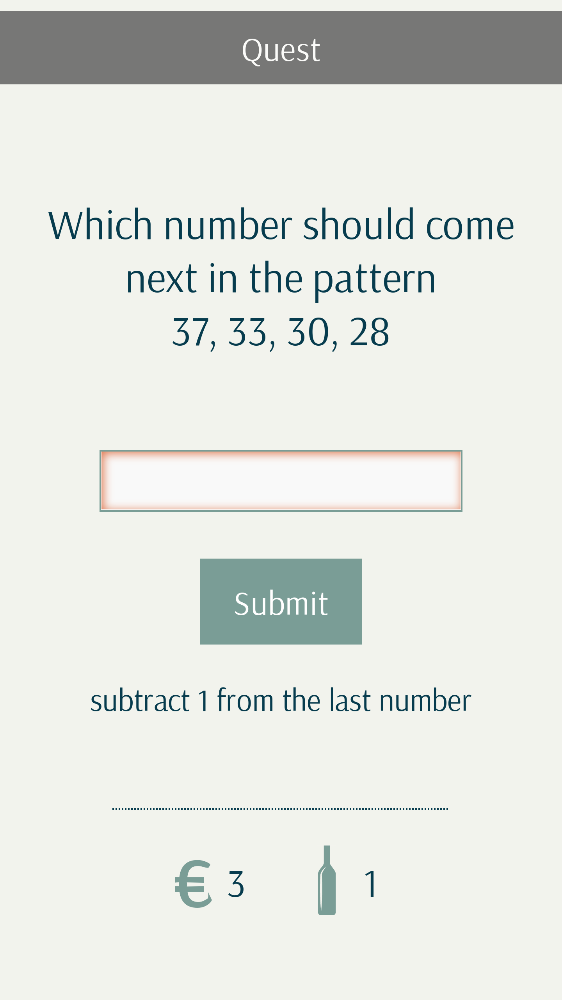

## Description

This is a simple web app designed to easily create and conduct quests online.
The app comprises of several components:
- The frontend part written in React (this repo)
- The backend part - [Nodejs Express server](https://github.com/serzhshakur/quest-application-node)
- Mongo database to store quests, sessions, users etc.

## Features the app currently supports
1) The quest itself consists of the following parts:
- Login screen where user provides a quest id; 
- Introductory screen where a brief description of a quest is provided;
- A series of questions each at a separate screen. User cannot proceed to the next question unless he provides a correct answer to a current one. User can request a hint. There are two types of penalties which take the form of points - penalties for wrong answers and penalties for hint requests. You as a quest admin can do whatever you want with these penalty points afterwards (monetize them, turn them into glasses of bear user need to buy you etc.)
- Last screen with a final words and results;
2) Admin panel provides the following features
- Authorized access (only authorized users can access the admin panel);
- Creating, modifying, deleting quests;
## Features the app currently lacks
- Images upload in admin panel while configuring a quest;
- Setting [optional] timer for a quest;
- Tests;

## Running the app
To locally launch the app run
```
QUESTS_API_HOST="http://my.localhost.com:8080" npm start
```
where `QUESTS_API_HOST` is a hostname of [Nodejs Express server](https://github.com/serzhshakur/quest-application-node)

## Building the app
To build the app for production use run
```
QUESTS_API_HOST_PROD="http://my-quest.herokuapp.com/" npm run build
```
where `QUESTS_API_HOST_PROD` is a hostname of [Nodejs Express server](https://github.com/serzhshakur/quest-application-node)

## Screenshots


